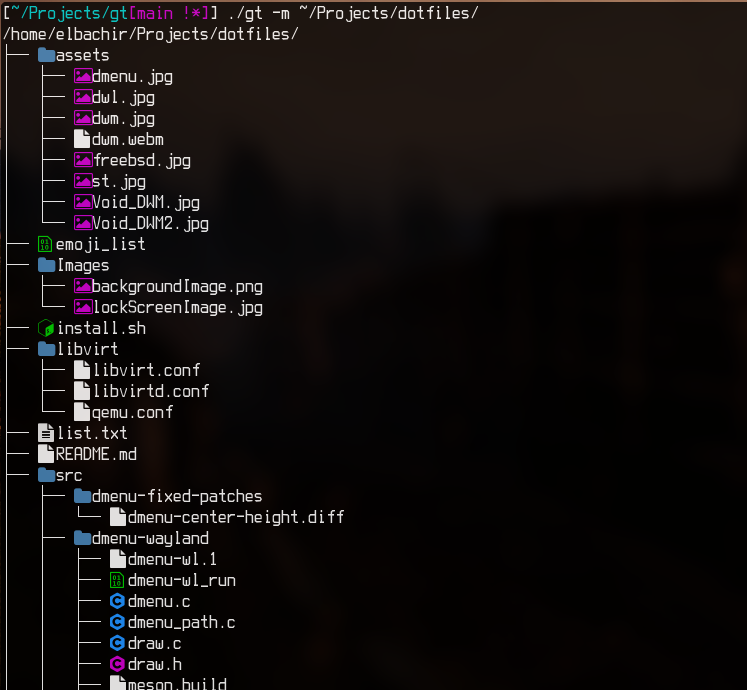

# gt

`gt`, short for `go tree`, is a command-line tool written in Go that
displays a tree of files and directories with colored icons.



## Features

- Displays a tree of files and directories.
- Supports showing hidden files.
- Option to unsort files.
- Displays summary of files and directories.
- Colored icons based on file types.
- List directories.
- Order files.
- Print full path.

## Installation

1. Ensure you have Go installed. You can download it from
   [golang.org](https://golang.org/).

2. Clone the repository

```bash
   git clone https://github.com/yourusername/gt.git
   cd gt
   go build gt.go
   ./gt
```

3. Install

```bash
    sudo cp gt /usr/local/bin/gt
```

## Usage

```bash
    gt [OPTIONS] [DIRECTORY]
```

Options:

| Option | Description                             |
|--------|-----------------------------------------|
| -h     | Show help                               |
| -v     | Show version                            |
| -s     | Show hidden files                       |
| -u     | Files                                   |
| -m     | Summary                                 |
| -d     | List directories only                   |
| -o     | Order files based on extension          |
| -f     | Print full path prefix to each file     |

## Contributing

Contributions, issues, and feature requests are always welcome! Thank you.
